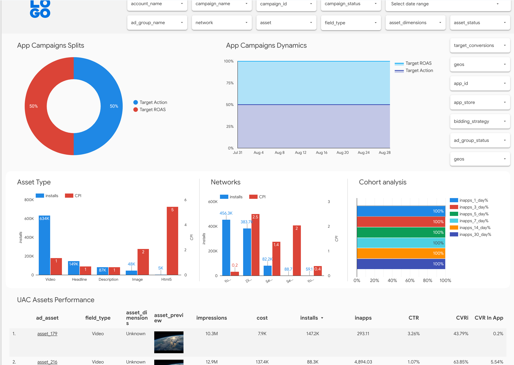

# App Reporting Pack - comprehensive reporting for Google App campaigns

Crucial information on App campaigns is scattered across various places in Google Ads UI which makes it harder to get insights into how campaign and assets perform.

App Reporting Pack fetches all necessary data from Ads API and creates a centralized
[dashboard](https://lookerstudio.google.com/c/u/0/reporting/3f042b13-f767-4195-b092-35b94e0b430c/page/0hcO)
showing different aspects of App campaign's performance and settings.
All data is stored in BigQuery tables that can be you can use separately.

## Features

App Reporting Pack covers the following areas of App campaigns:

* Asset level analytics
* Ad and Asset disapprovals monitoring
* Bids and budget monitoring
* Campaign changes monitoring
* Best practices adoption
* Store insights (Google Play, App Store)
* SKAN analytics

## Dashboard



View additional information on the dashboard [here](https://google-marketing-solutions.github.io/app-reporting-pack/#dashboard-previews).

## Installation

App Reporting Pack can be installed in [several ways](https://google-marketing-solutions.github.io/app-reporting-pack/installation/overview).

Here we'll cover a recommended one - installing in in Google Cloud.


1. Clone repo in Cloud Shell or on your local machine (we assume Linux with `gcloud` CLI installed):
```bash
git clone https://github.com/google-marketing-solutions/app-reporting-pack
```

1. Go to the repo folder: `cd app-reporting-pack/`

1. Optionally put your `google-ads.yaml` there or be ready to provide all Ads API credentials

1. Optionally adjust settings in `gcp/settings.ini`

1. Run installation:

```
./gcp/install.sh
```
Explore [other approaches](https://google-marketing-solutions.github.io/app-reporting-pack/installation/overview) to installing App Reporting Pack.

## Documentation

Explore full documentation on installing and customizing App Reporting Pack.

* [Documentation](https://google-marketing-solutions.github.io/app-reporting-pack/)

## Disclaimer

This is not an officially supported Google product.
