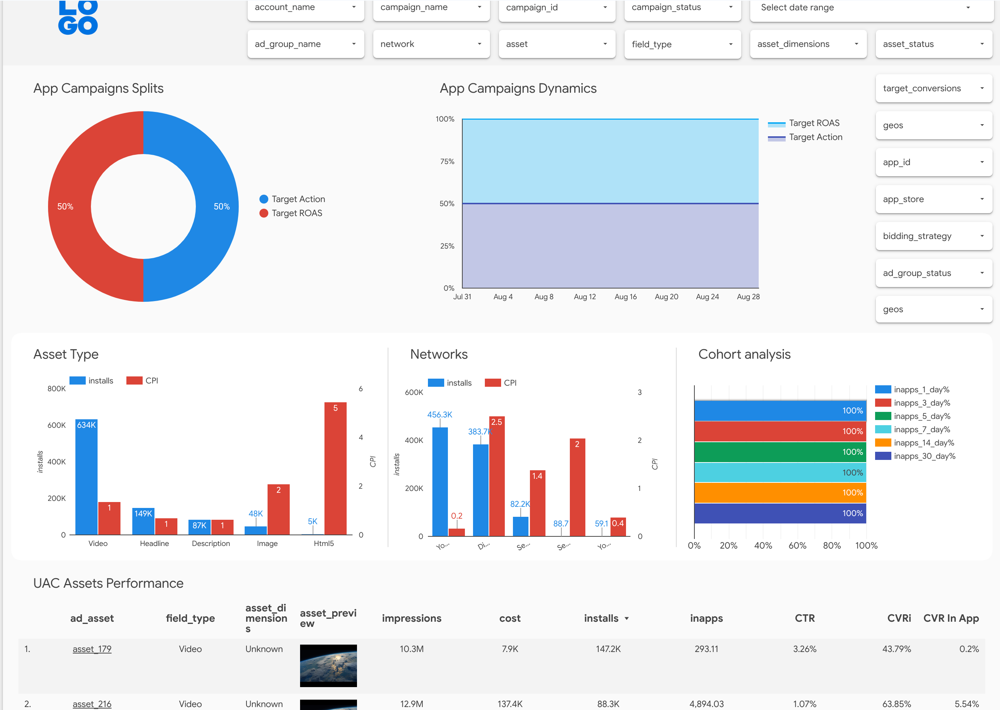

# App Reporting Pack - Comprehensive reporting for Google Ads App campaigns

App Reporting Pack is a dashboard for Google Ads App campaign data.

Crucial information on App campaigns is scattered across various places in Google Ads UI which makes it harder to get insights into how campaign and assets perform.

App Reporting Pack fetches all necessary data from Ads API and creates a centralized
[dashboard](https://lookerstudio.google.com/c/u/0/reporting/3f042b13-f767-4195-b092-35b94e0b430c/page/0hcO)
showing different aspects of App campaign's performance and settings.
All data is stored in BigQuery tables that can be you can use separately.

## Features

App Reporting Pack covers the following areas of App campaigns:

* Asset level analytics
* Ad and Asset disapprovals monitoring
* Bids and budget monitoring
* Campaign changes monitoring
* Best practices adoption
* Store insights (Google Play, App Store)
* SKAN analytics

## Dashboard previews

Explore the sample dashboard by clicking on the tabs below.

/// tab | assets

{ loading=lazy }

///

/// tab | bids & budgets

{ loading=lazy }

///

/// tab | hygiene

{ loading=lazy }

///

/// tab | changes

{ loading=lazy }

///

/// tab | disaprovals

{ loading=lazy }

///

/// tab | store insights

{ loading=lazy }

///

## Next steps

[Install](installation/overview.md) App Reporting Pack
