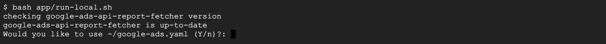
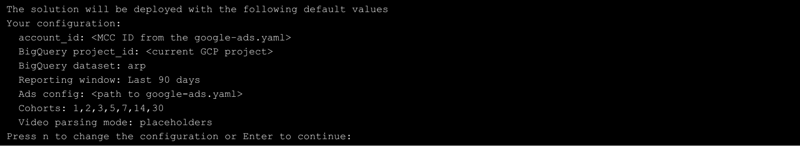
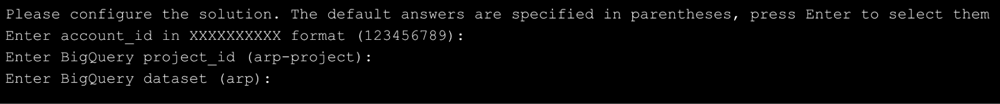
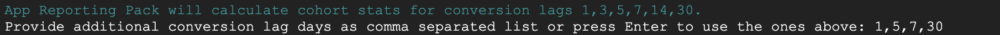
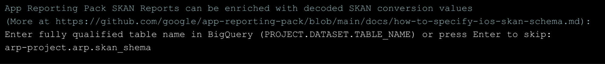

There are several ways to install the application.

<div class="grid cards" markdown>

- :material-google-cloud: [__Google Cloud__](gcp.md) *Recommended*
- :material-docker: [__Docker__](docker.md)
- :simple-apacheairflow: [__Airflow__](airflow.md)
- :material-console: [__Local__](local.md)

</div>

## Step-by-step deployment

Regardless of the method chosen you'll need to provide some information to configure
App Reporting Pack.

1. Validate that the dependencies are met.
	

### Default parameters

The script will offer to deploy ARP with default settings.
	

- **account_id** - Google Ads account or MCC Id provided in the google-ads.yaml.
- **BigQuery project_id** - current GCP project where the user is authenticated.
- **BigQuery dataset** - dataset in the current project where data will be stored.
- **Reporting window** - how much data will be daily extracted from Google Ads. You won't be able to see more data in your dashboard outside of reporting window.
- **Ads config path** - path to the provided google-ads.yaml.
- **Cohorts** - a list of offsets in days since the attributed interaction. ARP calculates how many conversions occur on 1st, 2nd, 5th day after an interaction with an ad.

!!!note
    You can either accept the default setting or press *N* to configure
    each parameter. But even if accepts the default settings you still will be
    asked additional question to configure optional SKAN schema
    for SKAN in-app events decoding.

### Custom parameters

If you opted out from the default settings you will be asked to set it up one by one. In most cases a default value will be offered (shown in parenthesis). In order to accept the default value a user can press Enter without typing anything.



#### Cohorts


Enter a comma separated list of numbers. If non-default values are used then some changes in the Looker Studio dashboard may be required, as the reports are configured to be used with the default cohorts.

#### SKAN schema

SKAN Schema is optional, it’s required if you want to have decoded SKAN in-app conversions in the report.

The schema is a BigQuery table in any dataset, not necessarily the dataset with the ARP data. The name of the table can also be arbitrary. After execution of the script the schema will be copied to the ARP dataset.

The script expects the schema as a fully qualified table name like `project.dataset.table_name`.



For more information on the SKAN schema set up see [SKAN ARP guide](../customization/skan.md).

## Advanced setup

ARP can be configured manually by editing the config.yaml file. Usually config.yaml is created by the deployment script based on the answers on the questions, but it’s also possible to create it from scratch or modify the existing file.

Sample `config.yaml`:

```
gaarf:
  output: bq
  bq:
    project: YOUR-BQ-PROJECT
    dataset: arp
  api_version: '21'
  account:
  - 'YOUR_MCC_ID'
  customer_ids_query: SELECT customer.id FROM campaign WHERE campaign.advertising_channel_type
    = "MULTI_CHANNEL"
  params:
    macro:
      start_date: :YYYYMMDD-91
      end_date: :YYYYMMDD-1
gaarf-bq:
  project: YOUR-BQ-PROJECT
  params:
    macro:
      bq_dataset: arp
      target_dataset: arp_output
      legacy_dataset: arp_legacy
      skan_schema_input_table: YOUR_PROJECT.YOUR_DATASET.YOUR_SKAN_SCHEMA_TABLE
    template:
      cohort_days: 1,3,5,7,14,30
      has_skan: 'true'
scripts:
  skan_mode:
    mode: placeholders
backfill: true
incremental: false
legacy: true
```

Important parameters:

* **api_version** - current Google Ads API version. It’s recommended to keep it up to date and use the most recent version. Please follow ARP updates.
* **start_date** - beginning of the reporting window. Usually it’s a macro :YYYYMMDD-N, where N is the length of the reporting window. It’s not recommended to to change start date as it may cause data disruption
* **end_date** - end of the reporting window. By default it’s the previous day YYYYMMDD-1
* **dataset** - name of the main dataset. ARP stores all the intermediate tables there
* **target_dataset** - name of the dataset where the output tables are stored
* **legacy_dataset** - name of the dataset for views for backward compatibility with older versions of ARP
* **skan_schema_input_table** - source SKAN schema name. If the schema wasn’t provided during the initial deployment, it can be set here
* **skan_mode.mode** - should be “table” if skan_schema_input_table is provided. Otherwise it’s “placeholder”
* **has_skan** - whether to extract SKAN reports. By default it’s true

